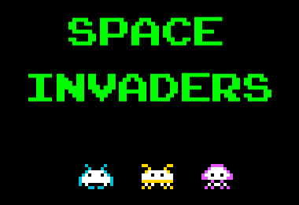
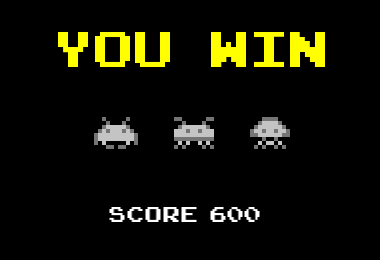

# Space Invaders

 

Jogo desenvolvido em trabalho proposto na disciplina de Programação e Desenvolvimento de Software 2. Inspirado no Space Invaders Linux, o grupo definido inicialmente para esse projeto foi: Ana Luíza Sossai, Iago Alves, Pedro Nunes, Luana Pina, Vítor Nunes

## **Ferramentas**

Esse projeto utiliza as seguintes linguagem, ferramentas e bibliotecas:

* Linguagem: [C++11](https://cplusplus.com/doc/)
* Compilação: [Make](https://www.gnu.org/software/make/)
* Interface Gráfica: [SFML](https://www.sfml-dev.org/index.php)
* Documentação: [Doxygen](https://doxygen.nl/)
* Testes Unitários: [Doctest](https://github.com/doctest/doctest)
* Cobertura: [gcovr](https://gcovr.com/)

## **Primeiro passo**

Para habilitar o uso da interface gráfica, digite no terminal:
```bash
$ sudo apt-get install libsfml-dev
```
* Em caso de dúvidas: (https://www.sfml-dev.org/tutorials/2.5/start-linux.php)

## **Compilação**

```bash
$ make
```

**Atenção: Criar antes um diretório _./build/_**

## **Execução**

```bash
$ make run
```

## **Compilação Testes**

```bash
$ make tests
```

## **Execução Testes**

```bash
$ make run_tests
```

## **Relatório de Cobertura**

Para imprimir o relatório simplificado no próprio Terminal, utilizar:
```bash
$ make coverage
```

Para gerar o relatório em HTML, utilizar:
```bash
$ make html_coverage
```

**Atenção: Criar antes um diretório _./coverage/_**

## **Documentação**

É necessário ter na raiz do projeto um arquivo _Doxyfile_. Um arquivo padrão pode ser gerado pelo comando:
```bash
$ doxygen -g
```

Abaixo a lista de flags que foram modificadas no arquivo original.

```
PROJECT_NAME           = "Space Invaders"

OUTPUT_DIRECTORY       = doc/

RECURSIVE              = YES

EXTRACT_ALL            = YES
EXTRACT_PRIVATE        = YES
EXTRACT_STATIC         = YES

HAVE_DOT               = NO
```

Para gerar a documentação, utilizar:

```bash
$ doxygen Doxyfile
```
ou
```bash
$ make documentation
```

**Atenção: Criar antes um diretório _./doc/_**

## **Remover arquivos auxiliares**
```bash
$ make clean
```
